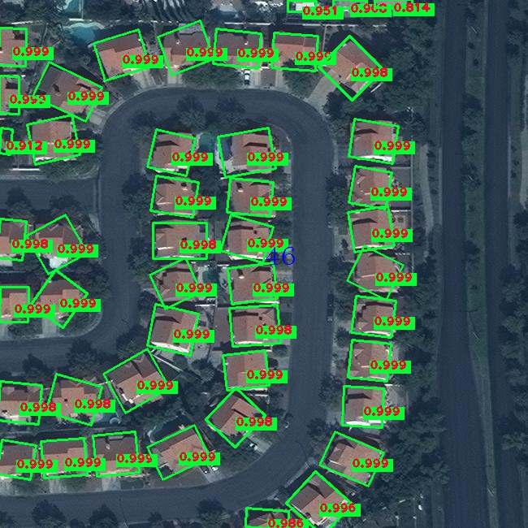
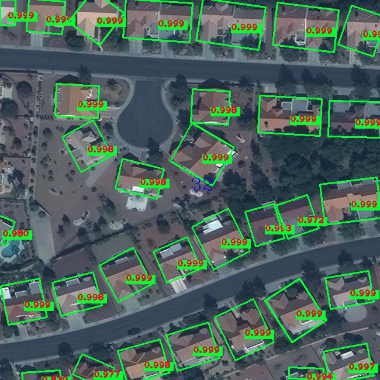
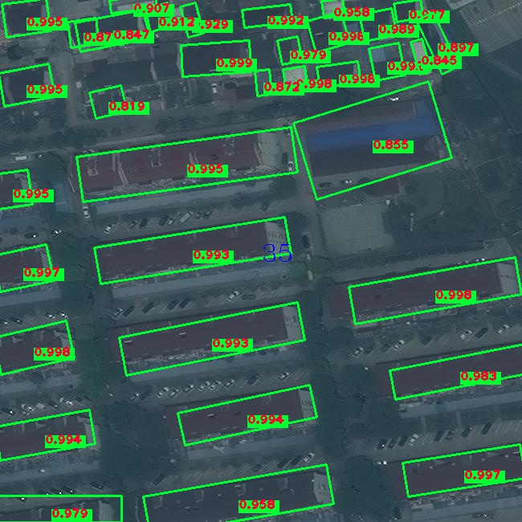
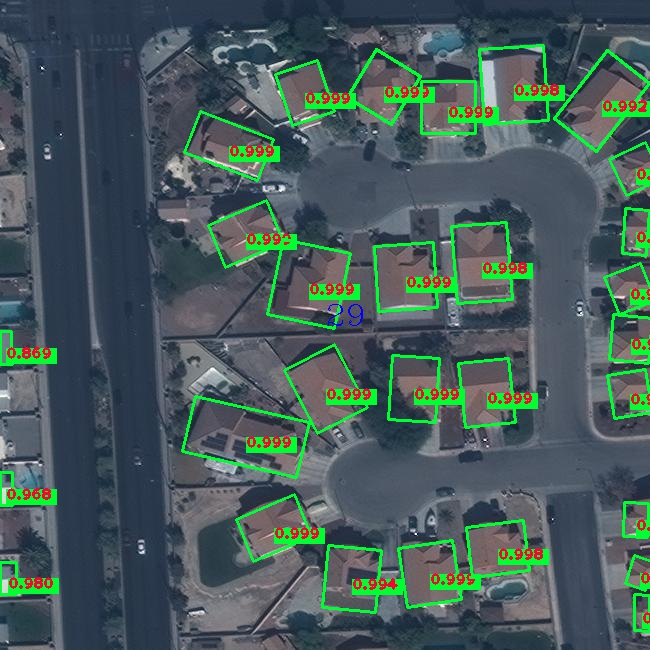
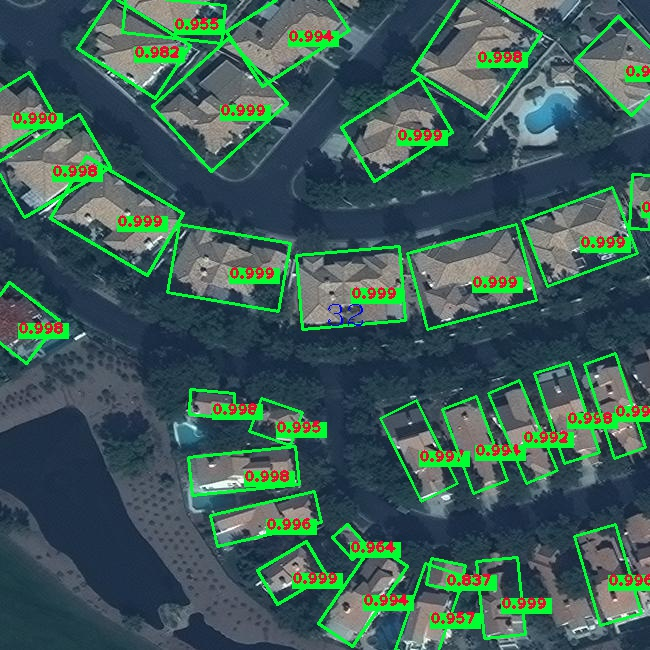
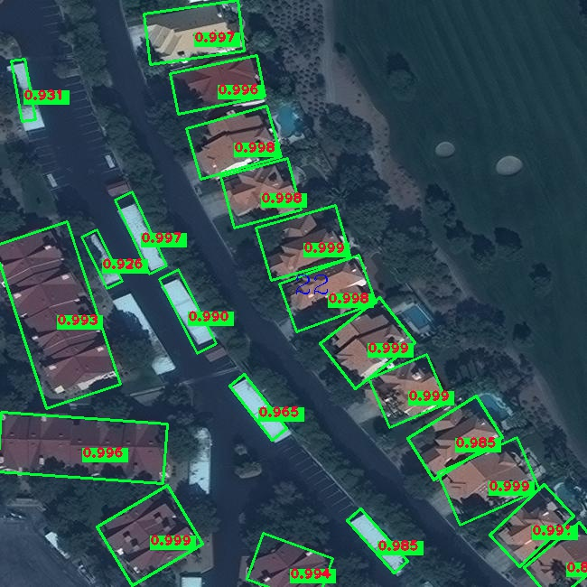

# Arbitrary-Oriented Scene Text Detection via Rotation Proposals(RRPN)
---

A Tensorflow implementation of **RRPN** based on **FPN**.
You can refer to the papers **RRPN** paper [here][1], and FPN paper [here][2].

We(me and [yang Xue][3]) also implement the $R^2 CNN$ ([link][4])based on FPN. And you can find the paper [here][5].
And we also proposed [R-DFPN][6], but papers is under review so the complete code and instructions are will uploaded later.
If useful to you, please star to support my work. Thanks.


---
##**Configuration Environment:**
ubuntu+ python2 + tensorflow1.2 + cv2 + cuda8.0 + GeForce GTX 1080
If you want to use cpu, you need to modify the parameters of NMS and IOU functions use_gpu = False in cfgs.py
You can also use docker environment.
```
docker push yangxue2docker/tensorflow3_gpu_cv2_sshd:v1.0
```

---

##**Installation:**

Clone the repository

---

##**Make tfrecords:**
The data is VOC format, reference [here][7]. You can make tfrecords as following:
```
cd $RRPN_ROOT/data/io/  
python convert_data_to_tfrecord.py --VOC_dir='***/VOCdevkit/VOCdevkit_train/' --save_name='train' --img_format='.jpg' --dataset='ship'
```

***If the format of your data is not VOC, you can follow my advices below and generate tfrecords by yourself.***

 - Features in TFrecords are as follow:
```
feature = tf.train.Features(feature={
            'img_name': _bytes_feature(img_name),
            'img_height': _int64_feature(img_height),
            'img_width': _int64_feature(img_width),
            'img': _bytes_feature(img.tostring()),
            'gtboxes_and_label': _bytes_feature(gtbox_label.tostring()),
            'num_objects': _int64_feature(gtbox_label.shape[0])
        })
# the format of gtboxes of label:
'''
gtboxes_and_label are gtboxes and labels in a img. It's a Matrix.
Shape:(num_objects, 9)
Contents:(x0, y0, x1, y1, x2, y2, x3, y3, category)

(x0, y0, x1, y1, x2, y2, x3, y3) are 4 vertices of inclined rectangle.
Note: they can be unorderd

(x0, y0)
+----------+(x1, y1)
|          |
+----------+(x2, y2)
(x3, y3)
'''
```

 - You can refer data/io/convert_data_to_tfrecord.py and data/io/read_tfrecord.pyto to make yourself code.

---

##**Demo**
This is a demo about detecting arbitrary-oriented buildings.(our dataset from SpaceNet and some modifications have been done)
1. Download Trained Weights: you can download trained weights **here**(the link will attach soon)
2. unzip them on ***/FPN_with_RRPN/output/trained_weights/FPN_RRPN_v1
3.
```
cd tools/
python inference.py
```
4. Put your test imgs on **FPN_with_RRPN/tools/inference_image**. I have uploaded some imgs for demo test.
5. Detection results will show on folder: **/FPN_with_RRPN/tools/inference_results**

---
##**Train**
1. download pretrain weight([resnet_v1_101_2016_08_28.tar.gz][8] or [resnet_v1_50_2016_08_28.tar.gz][9]) from [here][10], then extract to folder *data/pretrained_weights*.
2. Change the name of pretrained weights to 'resnet_v1_101.ckpt'(for resnet101), or 'resnet_v1_50'(for resnet 50).(you can also use softlink)
3.  
```
cd tools/
python train.py
```

---
##**Some Test Results**














  [1]: https://arxiv.org/abs/1703.01086
  [2]: https://arxiv.org/abs/1612.03144
  [3]: https://github.com/yangxue0827
  [4]: https://github.com/yangxue0827/R2CNN_FPN_Tensorflow
  [5]: https://arxiv.org/abs/1706.09579
  [6]: https://github.com/yangxue0827/R-DFPN_FPN_Tensorflow
  [7]: https://github.com/yangxue0827/R-DFPN_FPN_Tensorflow/blob/master/sample.xml
  [8]: download.tensorflow.org/models/resnet_v1_101_2016_08_28.tar.gz
  [9]: download.tensorflow.org/models/resnet_v1_50_2016_08_28.tar.gz
  [10]: https://github.com/yangxue0827/models/tree/master/slim